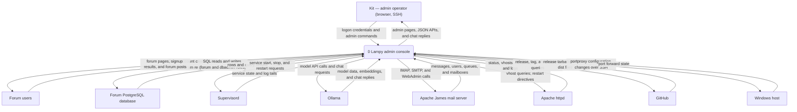
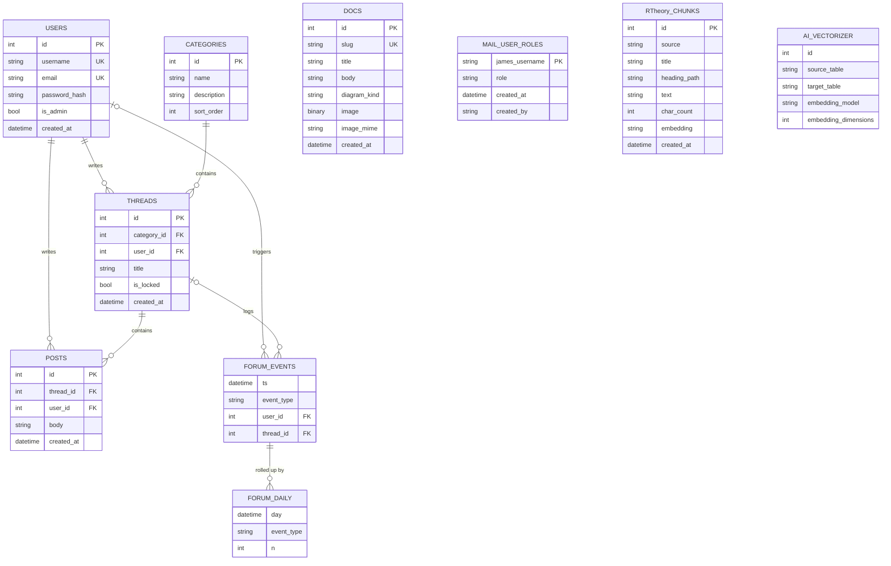

Living document — update these diagrams when adding features.
# lampy-admin — Architecture

Lampy administration console. A Flask web app (`console.py`, ~53K) plus an embedded asyncssh admin server that runs inside the `lampy` WSL distro as a supervisord program named `console` (root, `/opt/lampy-console`), bound to distro-localhost `127.0.0.1:8090` for the web UI (configurable via `CONSOLE_BIND`/`CONSOLE_PORT`) and `127.0.0.1:8022` for SSH admin. It gives Kit browser and terminal control of the whole Lampy forum stack — service health and restarts, forum browsing and posting, a generic PostgreSQL database browser, mail via Apache James (IMAP/SMTP plus the WebAdmin API), Ollama model management and Gwen chat, httpd admin, R Theory site deployment plus parse/vectorize/search, and console self-updates — with no Docker and no WSL terminal needed.

Console authentication **shares** the forum database: accounts are created by the forum app's `/register` and live in the forum `users` table with werkzeug password hashes; the console only verifies credentials against that table and keeps `{id, username, is_admin}` in the signed Flask session. Admin-gated areas require the forum `is_admin` flag. There is no separate account store.

## 1. Context diagram (level 0)

## 2. Level-1 data flow diagram

```mermaid
flowchart
    E1["Kit — admin operator (browser, SSH)"]
    E2["Forum users"]
    E3["Forum PostgreSQL database"]
    E4["Supervisord"]
    E5["Ollama"]
    E6["Apache James mail server"]
    E7["Apache httpd"]
    E8["GitHub"]
    E9["Windows host"]
    P1("1.0 Authenticate user")
    P2("2.0 Control stack services")
    P3("3.0 Read and write forum content")
    P4("4.0 Browse databases")
    P5("5.0 Manage mail")
    P6("6.0 Manage Ollama models and Gwen chat")
    P7("7.0 Check and apply updates")
    P8("8.0 Administer Apache httpd")
    P9("9.0 Manage Windows port forwards")
    P10("10.0 Parse and index R Theory site")
    D1[("D1 Forum database")]
    D2[("D2 Settings and model-override files")]
    D3[("D3 Mail credential vault (in-memory)")]
    D4[("D4 Deployed console files")]
    D5[("D5 Deployed R Theory site")]
    D6[("D6 PostgreSQL databases (dbadmin role)")]
    D7[("D7 Pending-action tokens (in-memory)")]
    D8[("D8 Gwen audit log")]
    E1 -->|"username and password"| P1
    E2 -->|"username and password"| P1
    P1 -->|"user row lookup"| D1
    D1 -->|"user row (id, username, is_admin, password_hash)"| P1
    P1 -->|"signed session (id, username, is_admin)"| E1
    P1 -->|"signed session"| E2
    E2 -->|"registration details"| P1
    P1 -->|"new forum account (is_admin=false)"| D1
    E1 -->|"service control requests (web and SSH)"| P2
    P2 -->|"service start, stop, and restart requests"| E4
    E4 -->|"service state and log tails"| P2
    P2 -->|"health cards, control results, and log pages"| E1
    E1 -->|"forum browse and write requests"| P3
    E2 -->|"forum browse and write requests"| P3
    P3 -->|"SELECT, INSERT, UPDATE statements"| D1
    D1 -->|"categories, threads, posts, events, docs, metrics"| P3
    P3 -->|"forum pages and write confirmations"| E1
    P3 -->|"forum pages and write confirmations"| E2
    P3 -->|"pg_dump forum backup"| E1
    E1 -->|"schema and SQL requests"| P4
    P4 -->|"DBADMIN queries (30s statement timeout)"| D6
    D6 -->|"schemas, tables, rows, CSV data"| P4
    P4 -->|"result grids and CSV export"| E1
    E1 -->|"mail credentials and mail actions"| P5
    P5 -->|"mail credentials"| D3
    D3 -->|"stored credentials"| P5
    P5 -->|"IMAP queries and outgoing messages"| E6
    E6 -->|"messages"| P5
    P5 -->|"WebAdmin user, queue, mailbox calls"| E6
    E6 -->|"users, queues, mailboxes"| P5
    P5 -->|"mail role assignments"| D1
    D1 -->|"mail roles"| P5
    P5 -->|"mail pages and compose results"| E1
    E1 -->|"model actions and chat messages"| P6
    P6 -->|"model list, pull, delete, and test-chat requests"| E5
    P6 -->|"chat requests with tool calls"| E5
    E5 -->|"model data and chat replies"| P6
    P6 -->|"pending-action token"| D7
    D7 -->|"token record"| P6
    P6 -->|"pending-action proposal"| E1
    E1 -->|"token confirmation"| P6
    P6 -->|"confirmed control directives"| P2
    P6 -->|"model override name"| D2
    D2 -->|"active model name"| P6
    P6 -->|"audit events"| D8
    P6 -->|"model pages and chat replies"| E1
    E1 -->|"update check and apply requests"| P7
    P7 -->|"release and commit queries"| E8
    E8 -->|"release info, tarballs, site-dist files"| P7
    P7 -->|"new console files"| D4
    P7 -->|"version and deployed SHA settings"| D2
    P7 -->|"deployed site files"| D5
    P7 -->|"update status pages"| E1
    E1 -->|"httpd administration requests"| P8
    P8 -->|"status, configtest, and vhost queries; restart directives"| E7
    E7 -->|"status, vhosts, modules, logs"| P8
    P8 -->|"httpd pages"| E1
    E1 -->|"proxy status and refresh requests"| P9
    P9 -->|"portproxy configuration changes over SSH"| E9
    E9 -->|"port forward state"| P9
    P9 -->|"proxy status pages"| E1
    P9 -->|"Refresh-WslPortForwards.ps1 download"| E1
    E1 -->|"parse, vectorize, and search requests"| P10
    D5 -->|"site HTML files"| P10
    P10 -->|"chunk rows"| D1
    D1 -->|"stored chunks"| P10
    P10 -->|"embedding requests"| E5
    E5 -->|"embedding vectors"| P10
    P10 -->|"search result pages"| E1
```

## 3. Entity–relationship diagram

The console owns no database of its own. It reads and writes the forum app's PostgreSQL schema and creates two tables in the forum database: `mail_user_roles` (W-4b) and `rtheory_chunks` (R Theory vectorization). `forum_daily` is a TimescaleDB continuous-aggregate materialized view over `forum_events`. `ai.vectorizer` is the pgAI catalog the worker tab reads.

## Grounding notes

- OBSERVED (auth.py): console logon verifies credentials against the forum `users` table (`SELECT id, username, password_hash, is_admin FROM users`) with `werkzeug.security.check_password_hash`; the signed Flask session keeps only `id`, `username`, `is_admin`. Docstring: "no separate account store". This VERIFIES the console-auth-sharing claim: admin areas gate on the forum's `is_admin` flag.
- OBSERVED (signup.py): `validate_signup` requires username 3–20 chars `[A-Za-z0-9_]`, valid email, password ≥ 8 chars, matching confirmation; `create_user` registers into `users` with `is_admin` false.
- OBSERVED (db.py): all forum reads/writes use the same SQL and validation as the forum app (title 1–200, body 1–20,000); `create_thread` inserts thread + first post + `thread_created`/`post_created` rows in `forum_events` in one commit; `create_reply` checks `is_locked` first; `keyword_search` is `posts.body ILIKE %q% OR threads.title ILIKE %q%`; `get_metrics` reads `forum_daily`; `get_users`/`set_thread_locked` are the admin tab.
- OBSERVED (schema.sql, forum repo): `users(id SERIAL PK, username VARCHAR(32) UNIQUE, email VARCHAR(254) UNIQUE, password_hash TEXT, is_admin BOOLEAN, created_at TIMESTAMPTZ, username_format CHECK)`; `categories(id SERIAL PK, name VARCHAR(80), description TEXT, sort_order INT)`; `threads(id PK, category_id REFERENCES categories, user_id REFERENCES users, title VARCHAR(200), is_locked, created_at)`; `posts(id PK, thread_id REFERENCES threads ON DELETE CASCADE, user_id REFERENCES users, body TEXT CHECK char_length(body) BETWEEN 1 AND 20000, created_at)`; `forum_events(ts TIMESTAMPTZ, event_type TEXT, user_id REFERENCES users, thread_id REFERENCES threads)` is a hypertable with no primary key; `forum_daily` is a TimescaleDB continuous-aggregate materialized view (`time_bucket('1 day', ts) AS day, event_type, COUNT(*) AS n`); `docs(id SERIAL PK, slug TEXT UNIQUE NOT NULL, title, body, diagram_kind TEXT, image BYTEA NOT NULL, image_mime TEXT NOT NULL, created_at)`. Corrects the previous doc: `slug` is UNIQUE, not PK; `forum_events` carries `ts`/`user_id`/`thread_id` FKs, not just `event_type`; `forum_daily.day` is a timestamp bucket, not a date.
- OBSERVED (mail_roles.py): `ensure_table` creates `mail_user_roles (james_username TEXT PRIMARY KEY, role TEXT CHECK (role IN ('admin','moderator')), created_at TIMESTAMPTZ DEFAULT now(), created_by TEXT)`; `james_username` has no FK to `users` — standalone entity.
- OBSERVED (rtheory.py): `ensure_tables` creates `rtheory_chunks (id SERIAL PRIMARY KEY, source TEXT, title TEXT, heading_path TEXT, text TEXT, char_count INTEGER, embedding vector(768), created_at TIMESTAMP)` when pgvector exists, `embedding TEXT` fallback otherwise; `parse_site`/`chunk_blocks` parse deployed site HTML, `embed_text` uses Ollama `nomic-embed-text`, `semantic_search` queries chunks.
- OBSERVED (worker_admin.py): worker tab reads the pgAI catalog `SELECT id, source_table, target_table, embedding_model, embedding_dimensions FROM ai.vectorizer` across databases; `ai` schema absent is the VEC-07 empty state.
- OBSERVED (stack.py): `STACK_SERVICES = [postgres, apache2, forum, ollama, james, pgai-worker, codeserver]` (7); `MANAGED = STACK_SERVICES + [bible, console]` (9); probes are real (TCP 5432 + SQL ping; HTTP 80 `/` and `/app/`; Ollama `/api/tags` JSON; James requires a `220` SMTP banner on 2587; pgai-worker from `supervisorctl status`); a card is green only when the supervisor program is RUNNING **and** its functional probe succeeds; `supervisor_control` whitelists actions to `start/stop/restart` on `MANAGED`; logs tailed from `/var/log/supervisor/<name>.log`; the console is excluded from stop-all/restart-all.
- OBSERVED (dbbrowser.py): W-1 database browser uses `DBADMIN_*` environment credentials (a second PostgreSQL role, default user `postgres`), read-only by default, per-session per-database write confirm, every statement `SET LOCAL statement_timeout = '30s'`, CSV export always read-only.
- OBSERVED (console.py): 60+ `@app.get`/`@app.post` routes covering `/stack` (control, control-all, logs), `/db/<dbname>` (schemas, table, sql, enable/disable-write, export), `/forum`, `/write`, `/docs`, `/metrics`, `/mail` (connect/disconnect/view/compose/send), `/admin` (users, lock toggle, forum-toggle, backup via `pg_dump` stream named `lampy-forum-backup-<stamp>.sql`), `/api/update` (check/apply), `/api/theory` (update-check/update-apply), `/gwen` + `/api/gwen` (chat, confirm, models list/pull/delete/test-chat/switch), `/mailadmin` (users, queues, mailboxes, roles), `/worker`, `/httpd` (status, vhosts, modules, configtest, restart, logs), `/windowstools` (proxy-status, refresh-proxy, refresh-script serving `Refresh-WslPortForwards.ps1`), `/rtheory` (deploy, parse, vectorize, search), `/login`, `/logout`, `/signup`, `/api/health`.
- OBSERVED (console.py mail vault): `_MAIL_VAULT[token] = {"user", "password"}` — credentials live only in the console process's in-memory dict keyed by `secrets.token_hex(16)`; the session cookie holds only the token; disconnect drops the entry. Never in the Flask session or on disk.
- OBSERVED (settings.py): settings live in root-owned `/opt/lampy-console/settings.json` (mode 600): `version` (default "1.1.0") and `forum_registered_only` (gates `/forum` behind logon).
- OBSERVED (updater.py): self-updater queries `api.github.com/repos/cosbykit-afk/lampy-admin/releases/latest`, downloads the tag tarball, rotates 3 backups of `/opt/lampy-console`, preserves `settings.json`, writes the new version to settings.
- OBSERVED (theory_updater.py): checks `cosbykit-afk/r-theory-rewrite` `site-dist` branch commit plus ledger files (`status_registry.json`, `ledger/index.html`) on `main`; `needs_rebuild` when the ledger changed but `site-dist` has not; deploy downloads the `site-dist` tarball into `/var/www/r-theory` (2 backups, `chown www-data`) and records `theory_site_sha`/`theory_ledger_sha` in settings.
- OBSERVED (james_admin.py): talks to the James WebAdmin API on `localhost:8001` (`JAMES_WEBADMIN_URL`); health, users CRUD, queues, mailboxes. IMAP/SMTP paths in `mail.py` use the mailbox user's own credentials.
- OBSERVED (httpd_admin.py): `service_status`, `config_test`, `list_vhosts`, `list_modules`, `log_tail`, restart.
- OBSERVED (ollama_admin.py): model list/pull (background `_pull_worker`)/delete/test-chat/disk usage; `gwen_chat.py` `get_model`/`set_model` persist the active model in `/opt/lampy-console/.gwen_model` (override file wins over `GWEN_MODEL`).
- OBSERVED (gwen_chat.py): Gwen chat tools are read-only (`get_status`) except control actions, which are NEVER executed inline — `execute_tool` returns a pending-action token (TTL 120 s, in-process dict), `/api/gwen/confirm` executes after Kit confirms; every event is appended to `/var/log/supervisor/gwen_audit.log`.
- OBSERVED (ssh_admin.py): embedded asyncssh server on 8022; key auth only against the existing Windows `authorized_keys`; no password, no interactive shell, single-command invocations; the console can never stop or restart itself.
- OBSERVED (windowstools.py): reaches the Windows host as `kitco@100.124.30.78` over SSH via the tailnet proxy; refreshes `netsh interface portproxy` entries (ports 5432, 80, 8000, 1143, 2587) toward the distro's WSL IP.
- OBSERVED (deploy/lampy-console.supervisor.conf): `[program:console]` runs `/usr/bin/python3 /opt/lampy-console/console.py` as root with `FORUM_DB_*`, `FORUM_SECRET_KEY`, `CONSOLE_ALLOW_HTTP`, `CONSOLE_PORT=8090`, `DBADMIN_*` from the root-only conf file; refuses to start without `FORUM_SECRET_KEY` outside dev (security.py).
- INFERRED: the DFD groups the 60+ routes into 10 processes by feature area; the grouping is my synthesis, not a repo-declared architecture layer.
- INFERRED: `ai.vectorizer` column types are not declared in the repo (only the SELECT list is observed); the ERD lists the observed columns without asserting SQL types.
- OBSERVED (GitHub main, commits since 2026-09-28): self-updater module, settings module, R Theory website updater (ledger detection + deploy), theory updater routes, website update-checker UI, forum login toggle, W-4b mail roles (module + tests), W-8 signup (routes + 9 tests), W-9 HTTPD tab (routes + 8 tests), W-8/W-9 docs, this SAD architecture doc.

## Relationship to the other repo

lampy-admin runs inside the distro that lampy-installer creates. The installer delivers the WSL distro, the forum app, and the Windows boot task; the console then operates all of it. The lampy-admin repo's `Refresh-WslPortForwards.ps1` is a Windows-side script that complements the installer's port setup, and its windowstools tab refreshes those same forwards. Updates are independent: the console self-updates from lampy-admin GitHub releases, and the theory updater pulls the r-theory-rewrite site-dist branch — neither path runs through the installer.
