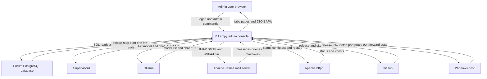
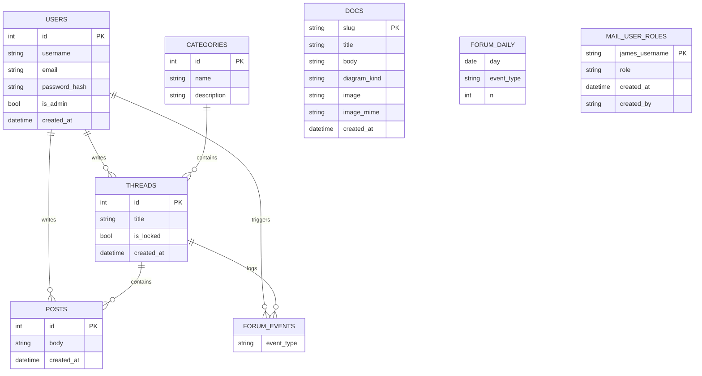

Living document — update these diagrams when adding features.
# lampy-admin — Architecture

Lampy administration console. A Flask web app plus an embedded asyncssh admin server that runs inside the lampy WSL distro as a supervisord program named "console", bound to 127.0.0.1:8090 for the web UI and 127.0.0.1:8022 for SSH admin. It gives Kit browser and terminal control of the whole Lampy forum stack — service health and restarts, forum browsing and posting, database browsing, mail via Apache James, Ollama model management and Gwen chat, httpd admin, R Theory site deployment, and self-updates — with no Docker and no WSL terminal needed. Accounts live in the forum database; there is no separate account store.

## 1. Context diagram (level 0)

## 2. Level-1 data flow diagram

```mermaid
flowchart
    E1["Admin user browser"]
    E2["PostgreSQL forum database"]
    E3["Supervisord"]
    E4["Ollama"]
    E5["Apache James"]
    E6["GitHub"]
    E7["Windows host"]
    P1("1.0 Authenticate user")
    P2("2.0 Control stack services")
    P3("3.0 Browse forum data")
    P4("4.0 Write forum content")
    P5("5.0 Manage mail")
    P6("6.0 Manage Ollama and Gwen")
    P7("7.0 Check and apply updates")
    D1[("D1 Forum database")]
    D2[("D2 Settings file")]
    D3[("D3 Mail credential vault")]
    D4[("D4 Deployed websites")]
    E1 -->|"username and password"| P1
    P1 -->|"verify against users table"| D1
    D1 -->|"user row with admin flag"| P1
    P1 -->|"session and admin flag"| E1
    E1 -->|"admin control commands"| P2
    P2 -->|"service commands"| E3
    E3 -->|"service state and logs"| P2
    P2 -->|"state cards"| E1
    E1 -->|"browse requests"| P3
    P3 -->|"read queries"| D1
    D1 -->|"categories threads posts docs metrics"| P3
    P3 -->|"pages"| E1
    E1 -->|"new thread or reply"| P4
    P4 -->|"validate and insert rows"| D1
    D1 -->|"confirm"| P4
    P4 -->|"new content"| E1
    E1 -->|"mail actions"| P5
    P5 -->|"IMAP SMTP and WebAdmin calls"| E5
    E5 -->|"messages queues mailboxes"| P5
    P5 -->|"hold creds in memory"| D3
    D3 -->|"creds"| P5
    P5 -->|"read and write roles"| D1
    P5 -->|"mail pages"| E1
    E1 -->|"model actions"| P6
    P6 -->|"HTTP calls"| E4
    E4 -->|"models and chat replies"| P6
    P6 -->|"model pages"| E1
    E1 -->|"check updates"| P7
    P7 -->|"release query"| E6
    E6 -->|"release info"| P7
    P7 -->|"new site files"| D4
    P7 -->|"new version"| D2
    P7 -->|"update status"| E1
    P2 -->|"port proxy commands"| E7
    E7 -->|"forward state"| P2
```

## 3. Entity–relationship diagram

The console owns no tables of its own except mail_user_roles, which it creates in the forum database. Everything else it reads and writes is the forum app's PostgreSQL schema plus one JSON settings file.

## Grounding notes

- Observed: README.md states the console runs inside the lampy WSL distro as supervisord program "console", binds 127.0.0.1:8090 web and 127.0.0.1:8022 SSH admin, covers nine supervisord services, logs in with forum accounts, and gates admin areas on the forum is_admin flag; the module table lists base console and W-1 through W-9 scopes with implementation status; the layout list names console.py, dbbrowser.py, auth.py, db.py, mail.py, security.py, ssh_admin.py, stack.py, templates, static, tests, docs, deploy.
- Observed: console.py is 1505 lines of Flask with routes for stack control, db browser with per-session write confirm and CSV export, forum read and write, search, docs, metrics, mail, admin user and thread lock and backup, self-update and theory-update APIs, Gwen chat and model management, mailadmin, worker, httpd, windowstools, rtheory deploy parse vectorize search, login and signup, and health.
- Observed: auth.py verifies credentials against the forum users table with werkzeug hashes and keeps only id, username, is_admin in the signed session; signup.py registers into users with is_admin false; db.py runs the same SQL and validation as the forum app and references tables users, categories, threads, posts, forum_events, docs, forum_daily, ai.vectorizer; mail_roles.py creates mail_user_roles with james_username primary key and role in admin or moderator; settings.py stores version and flags in /opt/lampy-console/settings.json; updater.py checks the lampy-admin GitHub releases latest endpoint and installs into /opt/lampy-console; theory_updater.py checks cosbykit-afk/r-theory-rewrite site-dist and deploys to /var/www/r-theory.
- Observed: windowstools.py manages Windows netsh port forwards via SSH to the Windows host at 100.124.30.78; the repo root also holds Refresh-WslPortForwards.ps1, a Windows-side companion script.
- INFERRED: the DFD groups routes into 7 processes by feature area; the module and route mapping is my synthesis, not a repo-declared architecture layer.
- INFERRED: FORUM_DAILY is treated as a standalone aggregate with a composite day plus event_type key — day, event_type, n were observed in a SELECT, not in a CREATE TABLE.
- Not observed: attributes of ai.vectorizer — only a row count query was seen, so it was left out of the ERD rather than guessed.

## Relationship to the other repo

lampy-admin runs inside the distro that lampy-installer creates. The installer delivers the WSL distro, the forum app, and the Windows boot task; the console then operates all of it. The lampy-admin repo's Refresh-WslPortForwards.ps1 is a Windows-side script that complements the installer's port setup, and its windowstools tab refreshes those same forwards. Updates are independent: the console self-updates from lampy-admin GitHub releases, and the theory updater pulls the r-theory-rewrite site-dist branch — neither path runs through the installer.
